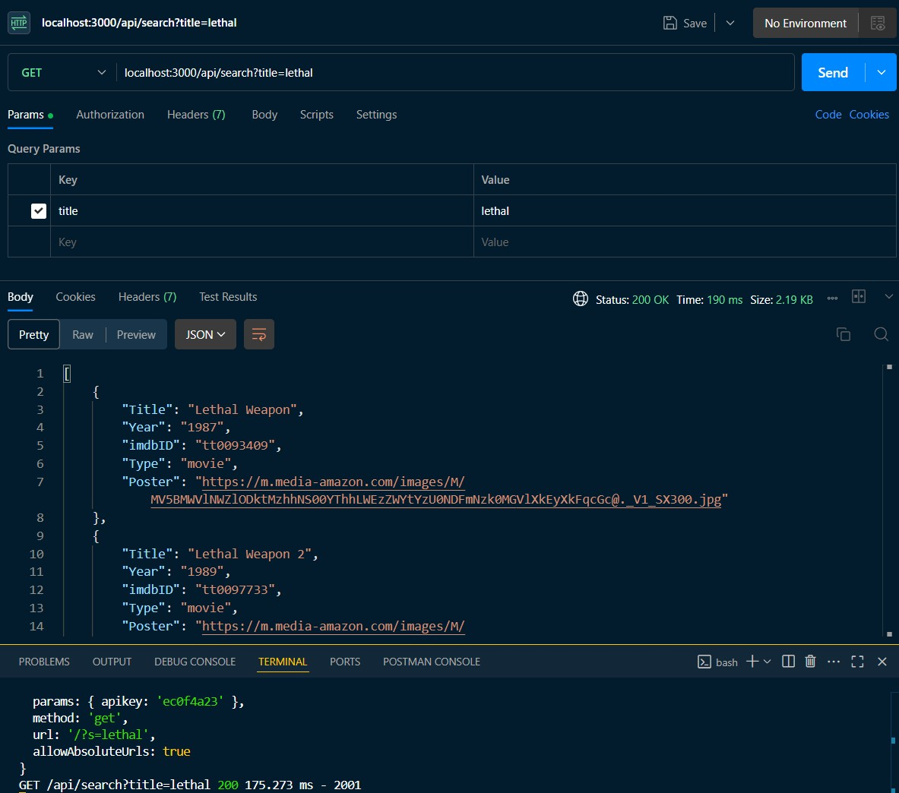
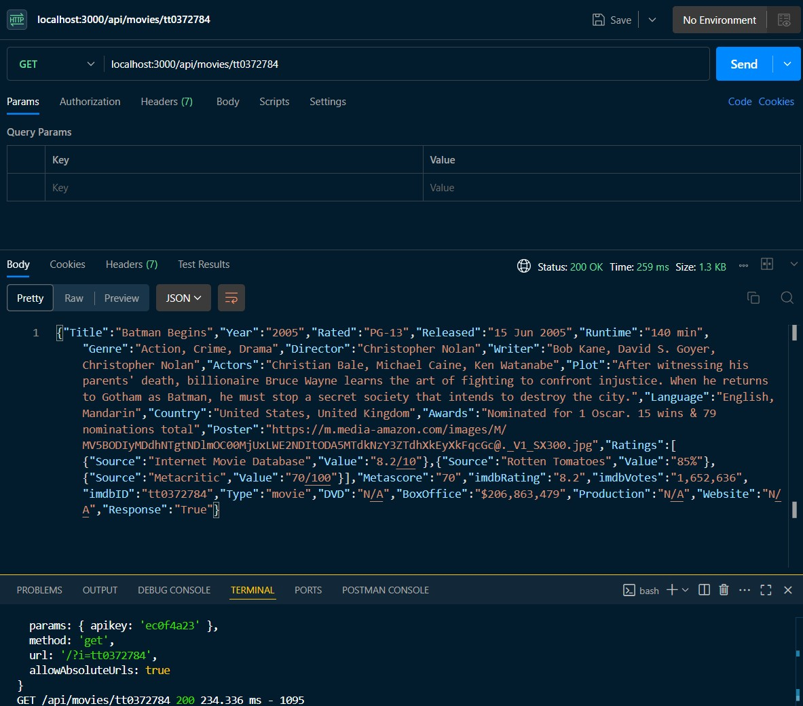
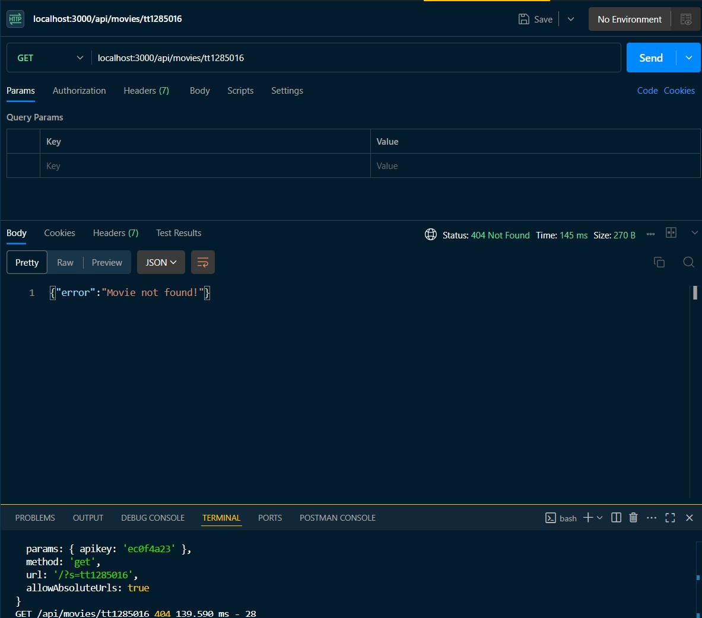

# Mod12 SBA: Build a RESTful Server

This is a solution using Express to the [Module 12 SBA](https://ps-lms.vercel.app/curriculum/se/318/sba).  

## Table of contents

- [Overview](#overview)
  - [Key Concepts](#key-concepts)
  - [Screenshot](#screenshot)
  - [Links](#links)
- [My process](#my-process)
  - [Built with](#built-with)
  - [What I learned](#what-i-learned)
  - [Continued development](#continued-development)
  - [Reflections](#reflections)
  - [Useful resources](#useful-resources)
- [Acknowledgments](#acknowledgments)

## Overview

This project follows RESTful API principles to ensure a clean, scalable, and predictable architecture for web services.

### Key Concepts
- Client-Server Separation: The frontend and backend operate independently. Clients interact with the server via clearly defined endpoints (URIs).

- Stateless Requests: Each request includes all necessary information. The server does not remember previous interactions.

- Uniform Interface:
    - Resource-Based URLs: Use nouns to represent resources (e.g., /api/movies/search).

    - HTTP Methods:
        - GET: Retrieve data
        - POST: Create new data
        - PUT / PATCH: Update data
        - DELETE: Remove data

    - Standard Format: Data is exchanged in JSON.

Understanding these REST principles is essential before working with or extending this API.

### Screenshot







### Links

- Solution URL: [GitHub: movie-finder-api](https://github.com/DblRH600/movie-finder-api/tree/main)
- Live Site URL: []()

## My process

### Built with

- NPM
- Node.js
- Express
- Axios
- DOTENV

### What I learned

Building the *Movie-Finder-API* tested my understanding of ***Express*** and how to set up the ***Project Structure & Configuration*** correctly. Additionally, the project further tested my understanding of how to setup ***express.Router()*** routes as well as futher practice with utilizing **try** / **catch** blocks for **error** handling using ***async*** / ***await*** functions  


```js movieController
import { movieClient } from '../api/movieClient.js'

export const searchMovies = async (req, res) => {
  const movieTitle = req.query.title
  console.log('Query: ', movieTitle)

  try {
    if (!movieTitle) {
      return res
        .status(400)
        .json({ error: 'Title query parameter is required' })
    }

    const apiResponse = await movieClient.get(`/?s=${movieTitle}`)

    const data = apiResponse.data

    if (data.Response === 'False') {
      return res.status(404).json({ error: data.Error })
    }

    res.json(data.Search)
  } catch (error) {
    console.error("searchMovies error: ", error.message)
    if (error.res) console.error(error.res.data)
    res.status(500).json({ error: 'An error occurred while fetching movies' })
  }
}

export const getMovieDetails = async (req, res) => {
  const movieId = req.params.id

  try {
    const apiResponse = await movieClient.get(`/?i=${movieId}`)

    const data = apiResponse.data

    if (data.Response === 'False') {
      return res.status(404).json({ error: data.Error })
    }

    res.json(data)
  } catch (error) {
    console.error("getMovieDetails error: ", error.message)
    if (error.res) console.error(error.res.data)
    res
      .status(500)
      .json({ error: 'An error occurred while fetching movie details' })
  }
}
```

### Continued development

There is still a *well* of *informaiton* to learn and *apply* regarding the use of **Express**, **Axios**, and the many functions and performances that can be used in setting up a **server**. Gaining a deeper understanding will help with the next phases of ***Full-Stack*** Development; connecting to a **Database** then establishing the **Front-End** to **Server** to **DB** (*Back-End*) connection.

### Reflections

### Useful resources

- [EXPRESSJS.COM](https://expressjs.com/en/5x/api.html#res.sendFile) - ***expressjs.com*** contains well documented information details about **routes**.

- [AXIOS](https://axios-http.com/docs/intro) - ***axios.com*** can be used to deepen one's understanding about the functionality **axios** is capable of performing that can be incorporated into a **server**.

- [REST API Tutorial](https://restfulapi.net/) - ***restfulapi.net*** provides background information and tutroials on how to build web-based **APIs** (*Application Programming Interfaces*).

## Acknowledgments
